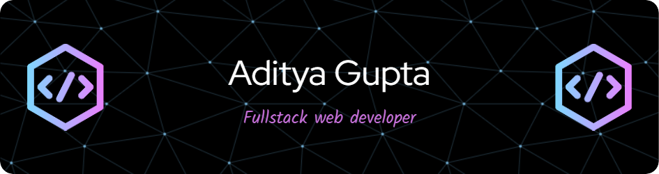

# Hi, I'm Aditya👋💻

  

## 👨🏻‍💻 &nbsp;About Me

🎓 &nbsp;I'm 2024 graduate in Electronics and Communication Engineering from JSS Academy Of Technical Education, Noida.\
💡 &nbsp;Some technologies I enjoy working with include ReactJS, JavaScript, NodeJS and ExpressJS and MongoDB.\
💡 &nbsp;Portfolio site(https://minimalist-portfolio-phi.vercel.app/). \
✉️ &nbsp;You can shoot me an email at adigupta.951@gmail.com! I'll try to respond as soon as I can.

## 🚀 Live Projects

Here are some of my live projects that you can check out:

- [Job Application Portal](https://job-portal-client-git-main-impulseadis-projects.vercel.app/) - A portal where users can apply for jobs and manage their applications also recruiter can post various jobs and manage candidates applications.
- [AI Image Generation SaaS](https://imagify-frontend-gnsc.onrender.com/) - A full-stack AI SaaS application using MongoDB, Express, React, and Node.js. It generates AI images from text prompts using the Clipdrop API.
-  [GreenCart Ecommerce Application](https://green-cart-sooty.vercel.app/) - A Full-stack Grocery Delivery platform using the MERN stack, enabling users to browse,filter, and order groceries by category.
-  [Modern Klimates Weather Application](https://klimates-6d1x.vercel.app/) - Developed an engaging and interactive Klimate Weather Application using React, Tanstack Query, Shadcn, Recharts, Tailwind and Typescript.
- [ReactJs Dice Game](https://timely-belekoy-5b7add.netlify.app/) - A dice game where user can play dice game with a core game concept.

## Find me around the web 🌎 

- Struggling on <a href="https://www.leetcode.com/impulseadi/">LeetCode</a> 😍
- Portfolio website <a href="https://minimalist-portfolio-phi.vercel.app/"> Portfolio</a>
- Practising on <a href="https://www.codeforces.com/profile/impulseadi/">Codeforces</a> 🙃
-  Practising on <a href="https://www.codechef.com/users/impulseadi09">Codechef</a> 🙃
-  Here's my <a href="https://drive.google.com/file/d/1k2Le6hVg1R_6unLgLNtI5AyuLdqPFAW0/view?usp=sharing">Resume</a>
- Sharing updates on <a href="https://www.linkedin.com/in/aditya-gupta-a419a9215/">LinkedIn</a> 😇

